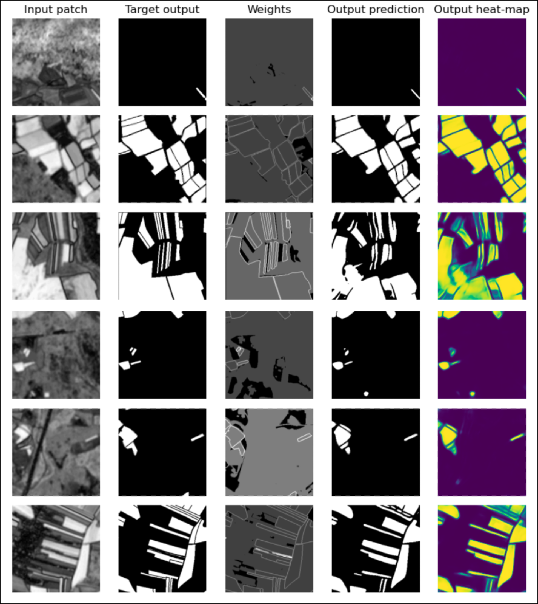

# ai4eo

An NDVI-based autoencoder approach for pixel-wise binary classification (detecting cultivated lands from Sentinel-2 satelite images). Submitted to the Land Management challenge of ESA's AI4EO initiative.

### Description
Afetr a first step of cloud masking, coregistration and upsampling of all the given Sentinel-2 images, we have computed the pixel-wise standard deviation of the NDVI over the resulting time series. We therefore obtained a single 2000x2000 image from each eo-patch (temporal information over data acquisition is now condensed in a single frame). All the resulting images were then split into 64 patches with shape 256x256 (the "input patches" in the figure) and fed to the DL model. The model consists of a convolutional autoencoder with a hierarchy of 13 convolutional + max-pooling layers in the encoder, and a corresponding set of convolutional + upsampling layers in the decoder. Finally, the aoutput of this model is passed through a softmax non-linearity, providing a pixel-wise classification (a segmentation map) as final output.

### Example Results

  

